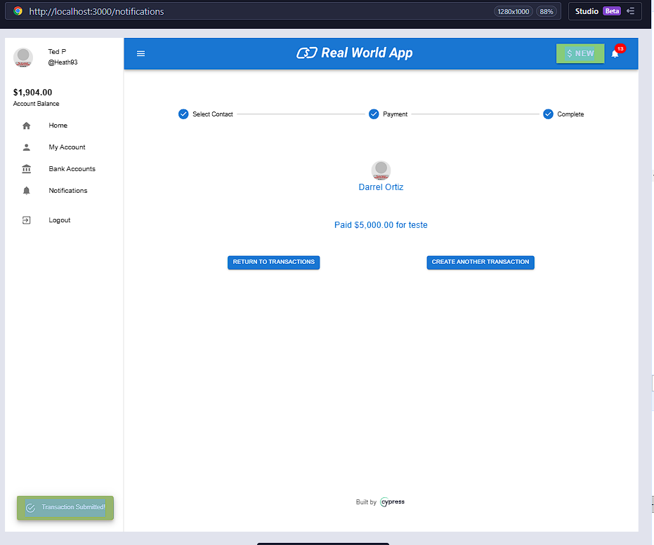

# 🐞 Bug Report — Real World App
**ID:** BUG-XX01  
**Título:** Sistema permite transfereência mesmo com saldo menor do que o valor enviado.

**Autor:** Thálik Andrade Parente  
**Data:** [21/10/2025]  
**Status:** Aberto 
**Gravidade:**  Alta 
**Prioridade:**  Alta  

---

## 🧭 Contexto
Durante a execução do caso de teste do Exercício 2 - CT-02 — Transferência com saldo insuficiente, foi identificado que o sistema permite a realização de uma transação mesmo quando o valor inserido é superior ao saldo disponível na conta.

---

## 🔄 Passos para Reproduzir
1. Acessar a tela inicial do site.
2. Fazer login com usuário válido
3. Clicar em "$ New", na tela inicial
4. Selecionar o contato para transferência.
5. Inserir o valor superior ao saldo disponível.
6. Inserir uma anotação.
7. Clicar em "pay"

---

## 🧪 Resultado Obtido
O sistema confirma a transferência, mesmo com saldo inferior.

---

## ✅ Resultado Esperado
A transação não deveria acontecer e deveria apresentar uma mensagem de erro: "Saldo insuficiente para realizar a transação."

---

## 📸 Evidências

---

## 💬 Observações
* O problema ocorre, independente do valor inserido.
* Não aparenta ter validação de salvo insuficiente criada.

**Ambiente de teste:**  
- Navegador: [ex: Google Chrome 141.0]  
- Sistema Operacional: Windows 11
- Ambiente: Localhost

---

## 💡 Sugestão de Correção
Incluir no processo, a validação do saldo, visando bloquear transações superiores ao saldo disponível.

---
